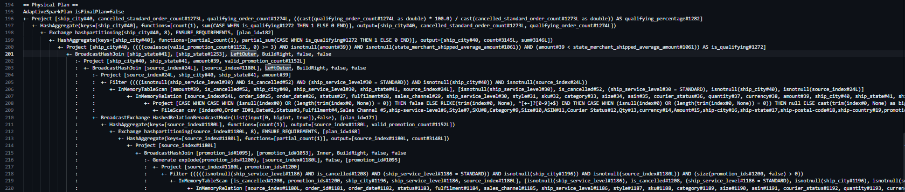
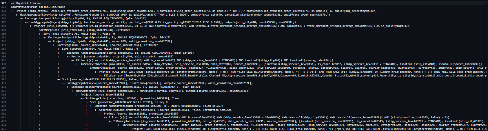
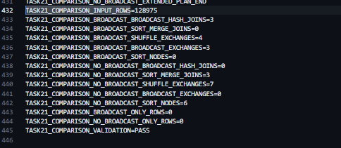

# LAB 3 REPORT — ADVANCED MAPREDUCE AND SPARK STRUCTURED APIs

## Task 1-1, Task 1-2, and Task 2-1

**Course:** Introduction to Big Data Analysis  
**Group:** _[Group name]_  
**Members:** _[Student IDs and full names]_  
**Execution date:** 7 September 2026

---

## 1. Executive summary

This report explains the complete reasoning and implementation of Task 1-1 and
Task 1-2 using Scala and Hadoop MapReduce, and Task 2-1 using Scala and Spark
DataFrames. The central design principle was to construct each query from its
business meaning before choosing framework operations. The work therefore
followed four levels:

1. define the semantic contract of every field and filter;
2. express the required result as a sequence of logical relations and
   aggregations;
3. translate those logical operations into MapReduce keys/jobs or Spark
   transformations, joins, aggregations, and exchange boundaries;
4. encode the physical plan as reusable Scala classes and verify the output.

Task 1-1 uses two jobs. The first job counts bought records by state and decides
whether the state uses a five-day or ten-day window. The second job reverse-maps
each bought record into every future window to which it contributes, aggregates
frequency and Amount moments, and selects one winning size per state and date.

Task 1-2 uses three jobs in the submitted global-eligibility mode. A preliminary
job creates the set of styles that served XXL or larger anywhere in the
dataset. The next two jobs compute distinct-SKU variety per
state-month-style and the exact median per state-month. A two-job local mode is
retained as a sensitivity analysis because the wording also supports applying
the size condition inside each state-month.

Both Task 1 outputs were checked in full by a reproducible, sequential Scala
reference calculation that does not use the MapReduce implementation classes.
Task 1-1 produced 3,696 data rows and the submitted global Task 1-2 produced 144
data rows. The 128-row local sensitivity output was also checked. Every
comparison produced zero mismatches.

Task 2-1 is implemented entirely with the Spark DataFrame API. Its result is
deliberately zero for every city: all 6,909 Cancelled + Standard source records
have empty promotion arrays, so none can reach the required three valid
promotions. After rejecting three records with no city, the single Parquet file
contains 1,434 city rows representing 6,906 denominator records. Spark and
Pandas both read the exported file successfully.

## 2. Requirements coverage

The report is organized to make the assessment evidence explicit rather than
leaving important decisions implicit in the source code.

| Assignment expectation | Where it is addressed |
|---|---|
| Task 1-1 key design and assignment to window buckets | Sections 4.4–4.7 |
| Task 1-1 naive and optimized complexity | Section 4.10 |
| Task 1-1 shuffle volume and optimization | Sections 4.7 and 4.11 |
| Task 1-1 tie-breaking rule and justification | Section 4.8 |
| Task 1-2 query understanding and decomposition | Sections 5.1–5.4 |
| Task 1-2 distinct-SKU and median implementation | Sections 5.5–5.8 |
| Task 2-1 query decomposition and zero-result proof | Sections 6.1–6.4 |
| Task 2-1 `explain(true)`, joins, exchanges, and stages | Sections 6.5–6.6 |
| Task 2-1 Parquet export and validation | Sections 6.7–6.8 |
| Trade-offs and reasons for accepting them | Sections 4.9, 4.10, 5.6, 5.8, 6.6, and 7 |
| Correctness and performance evaluation | Sections 4.11, 5.10–5.12, 6.7–6.8, and 7 |

## 3. Method: from a question to a MapReduce query

### 3.1. Why the design does not start from OOP

Object-oriented programming is useful for structuring the implementation, but it
does not determine the query. Starting from classes such as Mapper, Reducer, or
Writable would risk encoding an accidental interpretation of the English
question. The query was therefore constructed first:

- What is one valid input observation?
- Which records are in the domain of the query?
- What is the grouping key?
- Which statistics are sufficient for each group?
- Does one logical result require global information from an earlier stage?
- Which ordering or tie-breaking rules must be total and deterministic?

Only after answering these questions was the query translated into Hadoop
objects.

### 3.2. Role of OOP in the implementation

OOP is used as the physical-plan boundary:

- shared parsing and business rules are centralized in <code>AmazonCsv</code>
  and <code>LabRules</code>;
- each mapper owns record-level transformation;
- each reducer owns one group-level invariant;
- composite key classes define the sort contract;
- partitioner and grouping-comparator classes define where a logical group is
  processed;
- driver classes define dependencies between jobs and publish the final file.

The custom Hadoop types are mutable <code>Writable</code> or
<code>WritableComparable</code> classes rather than idiomatic immutable Scala
case classes. This is intentional: Hadoop serializes these types directly and
reuses objects heavily. The trade-off is more boilerplate and careful
<code>set</code>, <code>write</code>, and <code>readFields</code> methods. The
accepted benefit is framework compatibility, lower allocation pressure, and
explicit control of binary representation and ordering.

### 3.3. Shared data contract

The source contains quoted CSV fields, including promotion identifiers that may
contain commas. Splitting a line with a plain comma would therefore corrupt
column positions. <code>AmazonCsv</code> uses Apache Commons CSV and returns
either a parsed sale record or a parse error.

The following normalization rules are shared by both tasks:

- dates are parsed with the source format <code>MM-dd-yy</code>;
- states are normalized with <code>UPPER(TRIM(ship-state))</code>;
- blank required fields exclude a record only from the calculation that needs
  that field;
- the abnormal state value <code>APO</code> is excluded;
- geographic aliases such as NEW DELHI and DELHI are not silently merged;
- sizes use an explicit business rank instead of lexical comparison.

| Size | Rank | Size | Rank |
|---|---:|---|---:|
| XS | 1 | XXL | 6 |
| S | 2 | 3XL | 7 |
| M | 3 | 4XL | 8 |
| L | 4 | 5XL | 9 |
| XL | 5 | 6XL | 10 |

The value Free has no rank and does not satisfy the at-least-XXL predicate.

### 3.4. Input and execution environment

| Item | Value |
|---|---|
| Language | Scala 2.13.18 |
| Java runtime | Java 17 |
| Hadoop | Apache Hadoop 3.5.0 |
| Build tool | Maven 3.9.11 in the build container |
| HDFS | 1 NameNode, 2 DataNodes, replication factor 2 |
| YARN | 1 ResourceManager, 2 NodeManagers |
| HDFS input | <code>/lab3/input/amazon_sales.csv</code> |
| Executable JAR | <code>target/lab3-1.0.0-all.jar</code> |
| Number of physical input lines | 128,976 |
| Number of data records | 128,975 |
| Number of columns | 24 |
| Source date range | 31 March 2022 to 29 June 2022 |

The input contains 7,795 rows with no Amount and 33 rows with no shipping
location. Null handling is defined separately for each query because removing
all such rows globally would change unrelated statistics.

---

## 4. Task 1-1 — dynamic-length sliding window

### 4.1. Semantic interpretation

For every valid state and result date <code>d</code>, the query selects the size
that occurs most frequently among bought records in the immediately preceding
window.

The window length depends on the total number of bought records for that state
over the entire dataset:

~~~text
totalBought(state) > 10,000  =>  L(state) = 5 days
totalBought(state) <= 10,000 =>  L(state) = 10 days
~~~

The window for result date <code>d</code> is:

~~~text
[d - L(state), d - 1]
~~~

The current date is deliberately excluded. A record dated <code>t</code> can
therefore contribute only to result dates after <code>t</code>.

A record is treated as bought when:

~~~text
UPPER(TRIM(Status)) contains SHIPPED
and Qty > 0
~~~

Frequency means the number of bought records, not the sum of Qty. Qty is used
only by the bought predicate and is not the aggregation weight. The phrase
“variance of the purchased amount” is interpreted as variance of the dataset's
<code>Amount</code> column, not variance of <code>Qty</code>, because Amount is
the exact named monetary field. The reference analysis reports that the two
interpretations would change 204 of 3,696 winners, so this decision is stated
explicitly rather than hidden in code.

### 4.2. Null and invalid-value policy

Task 1-1 requires a state, date, and size. A bought row missing any of these
cannot be assigned to a state-window-size bucket and is rejected from this task.

A bought row with a null Amount remains part of size frequency. It is excluded
only from the Amount variance. Two counts are consequently required:

- <code>purchaseCount</code> counts every valid bought record;
- <code>amountCount</code> counts only records with a valid Amount.

If every Amount for a tied size is null, its variance is undefined. A candidate
with a defined variance is preferred to a candidate with undefined variance.
This makes the ordering total without inventing a numeric Amount.

An output row is generated only when a state-date window contains at least one
bought record. The implementation does not manufacture winners for empty
windows.

### 4.3. Logical query construction

The logical query can be expressed in five relations.

**Step A — Normalize the source**

~~~text
R = normalized valid CSV records
~~~

**Step B — Select bought observations**

~~~text
B = SELECT state, orderDate, size, Amount
    FROM R
    WHERE isBought = true
      AND state, orderDate, and size are valid
~~~

**Step C — Determine one window length per state**

~~~text
C(state) = COUNT bought records in R for state

L(state) = 5  if C(state) > 10,000
           10 otherwise
~~~

**Step D — Expand each observation into its result-date buckets**

For every record <code>b</code> in B:

~~~text
Expanded(b) =
  one observation for each d in
  b.orderDate + 1 ... b.orderDate + L(b.state)
~~~

This is equivalent to the original interval condition because:

~~~text
b.orderDate is in [d - L, d - 1]
if and only if
d is in [b.orderDate + 1, b.orderDate + L]
~~~

**Step E — Aggregate and select**

~~~text
Candidate(state, d, size) =
  purchase count,
  count of non-null Amount,
  sum of Amount,
  sum of squared Amount

Result(state, d) =
  best Candidate ordered by:
  1. purchase count descending
  2. population variance ascending
  3. size lexicographically ascending
~~~

This derivation is the key reason the MapReduce design is correct: the mapper
does not approximate a sliding window. It emits exactly the set of logical
members of every window.

### 4.4. Physical MapReduce plan

~~~mermaid
flowchart TD
    A[Raw CSV] --> B[Job 0 mapper: bought row to state and 1]
    B --> C[Job 0 combiner and reducer: totalBought by state]
    C --> D[Distributed Cache: state to totalBought]
    A --> E[Job 1 mapper: reverse-map row to future window dates]
    D --> E
    E --> F[Combiner: moments by state-date-size]
    F --> G[Shuffle: full sort, state-date grouping]
    G --> H[Reducer: evaluate sizes and select winner]
    H --> I[Task_1-1.csv]
~~~

<!-- Optional explanatory figure idea: draw a horizontal timeline with one
record at date t and arrows to t+1 through t+L. Shade the interval [d-L,d-1]
for one destination date d. This would visually prove the reverse-mapping
equivalence, but the Mermaid pipeline and algebra above are sufficient. -->

### 4.5. Job 0: state-level bought counts

The first mapper parses the raw CSV, applies the bought predicate, checks the
state, and emits:

~~~text
key   = state
value = 1
~~~

<code>LongSumReducer</code> is used as both combiner and reducer because integer
addition is associative and commutative. It is therefore safe to aggregate
locally before shuffle and again globally.

The observed counts that cross the threshold were:

| State | Bought records | Selected window |
|---|---:|---:|
| KARNATAKA | 14,950 | 5 days |
| MAHARASHTRA | 19,103 | 5 days |

All other valid states use ten days.

Job 0 uses one reducer. Its output contains only 46 state-count pairs, so
parallelizing this reduce stage would add scheduling and file-management
overhead without useful throughput. A single reducer also creates one cache file.
The resulting <code>part-r-00000</code> is localized under the stable name
<code>task11-state-counts.tsv</code>.

Each Job 1 mapper loads that 46-row table once in <code>setup</code> and performs
an in-memory lookup for every bought record. This is a map-side broadcast join.
It avoids an HDFS lookup per record and avoids sending the state count with every
intermediate value.

Importantly, Job 1 reads the raw CSV again. Job 0 supplies only the small
state-to-count table; it does not pass filtered sale records to Job 1. Reading
the source twice is the accepted cost of resolving a global condition before
bucket assignment.

### 4.6. Job 1 mapper: reverse assignment to buckets

For each valid bought record at date <code>t</code>, the mapper looks up the
state window length and emits to:

~~~text
t + 1, t + 2, ..., t + L
~~~

For example, a GOA record on 5 April 2022 with size M and a ten-day window emits
the following logical keys:

~~~text
(GOA, 2022-04-06, M)
(GOA, 2022-04-07, M)
...
(GOA, 2022-04-15, M)
~~~

It does not emit to 5 April because the result-date window excludes its own
date.

The composite map key is:

~~~text
WindowSizeKey(state, windowDateEpochDay, size)
~~~

The date is serialized as an epoch day, which gives compact numeric comparison
and is converted back to ISO format only when writing the final CSV.

The map value contains additive sufficient statistics:

~~~text
WindowMoments(
  size,
  purchaseCount,
  amountCount,
  amountSum,
  amountSquareSum
)
~~~

For Amount 500, the value is:

~~~text
(M, 1, 1, 500, 250000)
~~~

For a null Amount, it is:

~~~text
(M, 1, 0, 0, 0)
~~~

The statistics are sufficient because count, sum, and sum of squares can be
merged without retaining individual Amount values.

### 4.7. Combiner, partitioning, grouping, and secondary sort

The combiner aggregates all values with the same complete
<code>(state, date, size)</code> key on a mapper. For example:

~~~text
(GOA, 2022-04-10, M) -> (M, 1, 1, 500, 250000)
(GOA, 2022-04-10, M) -> (M, 1, 1, 600, 360000)
(GOA, 2022-04-10, M) -> (M, 1, 0,   0,      0)

combined:
(GOA, 2022-04-10, M) -> (M, 3, 2, 1100, 610000)
~~~

The complete key must be used for combiner grouping. Grouping only by state and
date at this point would incorrectly add moments belonging to different sizes.

The shuffle contracts are intentionally different:

| Component | Fields used | Purpose |
|---|---|---|
| Full sort | state, date, size | Place sizes of one window next to each other in deterministic order |
| Partitioner | state, date | Send every competing size for one window to the same reducer |
| Reducer grouping comparator | state, date | Invoke reduce once for the whole window |
| Combiner grouping comparator | state, date, size | Combine only identical candidates |

Because reducer grouping removes size from the logical key, size is repeated in
<code>WindowMoments</code>. The reducer then observes values ordered in
contiguous size blocks. It needs only the current size accumulator and the
current winner, rather than a map containing every size.

This is an example of secondary sort: Hadoop performs the expensive external
sort, while the reducer performs a streaming group scan with constant
application memory.

### 4.8. Population variance and deterministic winner selection

For a candidate with <code>N = amountCount</code>:

~~~text
mean = amountSum / N

populationVariance =
  amountSquareSum / N - mean squared
~~~

For Amount values 500 and 600:

~~~text
N = 2
sum = 1100
sumSquares = 610000
mean = 550
populationVariance = 610000 / 2 - 550 squared = 2500
~~~

The implementation clamps a tiny negative floating-point result to zero. Such a
negative can occur through rounding even though mathematical variance cannot be
negative.

The reducer applies a total order:

1. greater purchase frequency wins;
2. if frequency ties, smaller defined population variance wins;
3. a defined variance precedes an undefined variance;
4. if still tied, the lexicographically smaller size wins.

The reference profile finds 514 of 3,696 windows with at least two sizes tied
for highest frequency. Therefore the variance rule is operationally important,
not merely a theoretical edge case.

Population variance is used rather than sample variance because the records in
the window are the complete population being described, not a sample from which
an external population is estimated. Lexical size is only the final
deterministic tie-break required by the task; it is not the business size rank.

The reducer calls its candidate-finalization routine whenever size changes and
once more after the iterator ends. The final call is necessary because there is
no following size to close the last block.

### 4.9. Alternatives and accepted trade-offs

**One job with a hard-coded window.** This would be simpler, but incorrect
because the window depends on a global state count not known to a record-level
mapper. The two-job dependency is required for correctness.

**Reducer-side join with state counts.** This could avoid Distributed Cache but
would send both count and sale streams through shuffle and complicate ordering.
Broadcasting 46 rows is clearly cheaper.

**Store all Amount values.** This would make variance calculation intuitive but
would increase shuffle size and reducer memory. Additive moments preserve the
population variance for the chosen floating-point representation with constant
state.

**Use an in-memory map of sizes in the reducer.** There are few size labels, so
this would work on this dataset. Secondary sort was selected because it states
the grouping contract explicitly, streams in constant application memory, and
demonstrates a generally scalable MapReduce pattern. Its cost is additional key,
partitioner, and comparator code.

**Use multiple reducers.** The partitioner supports correct parallel execution,
but the assignment requires one physical CSV file. One final reducer guarantees
one header and global state-date order. The accepted trade-off is a serial final
stage. At this dataset size, the output contains only 3,696 groups, so the
reducer is not a practical bottleneck. For larger data, multiple reducers plus a
separate ordered merge would be preferable.

### 4.10. Complexity analysis, including the asymptotic alternative

Let:

- <code>N</code> be the number of source records;
- <code>n</code> be the number of valid bought records;
- <code>w</code> be the window length, with <code>w <= 10</code>;
- <code>E</code> be the sum of all selected window lengths over bought records;
- <code>K</code> be the number of combined state-date-size records entering the
  reducer.

| Stage | Time | Main application memory |
|---|---|---|
| Job 0 map and local sum | O(N) | O(1) per record |
| Job 0 final state sum | O(n) total | O(1) per state group |
| Job 1 direct bucket expansion | O(E), bounded by O(n × w) | O(1), plus 46 state counts |
| Combiner | O(E) total | one aggregate per local full key |
| Framework sort/shuffle | approximately O(K log K) after local combining | Hadoop external sort |
| Winner reducer | O(K) | O(1) current candidate and winner |

A naive direct bucket method emits one record for each window membership and is
therefore O(n × w). That is also the implemented mapper complexity. The
implementation optimizes its network cost, not this asymptotic mapper bound:
the combiner collapses repeated full keys before data crosses the network.

An asymptotically different design could use a difference array. A bought record
would emit a positive moment at <code>t+1</code> and a negative moment at
<code>t+L+1</code>. A prefix scan would reconstruct every window aggregate. It
would require two boundary emissions per bought record:

~~~text
2 × 109,566 = 219,132 theoretical boundary emissions
~~~

This is less than the 925,395 direct bucket emissions. However, a useful prefix
order is state-size-date, whereas selecting a winner requires state-date-size.
The alternative would therefore need another repartitioning job, careful
generation of sparse dates, and more stateful reducer logic. Since the maximum
window is only ten days and the implemented combiner reduced actual
post-combine records to 27,134, direct buckets were selected for transparency
and lower pipeline complexity. This report does not claim that the difference
array was implemented.

The three shuffle strategies requested by the reference material can be
compared directly:

| Strategy | Intermediate records | Relative interpretation | Implemented? |
|---|---:|---|---|
| Direct emission to every daily bucket | 925,395 | O(n × w), before combining | Yes |
| Difference-array boundaries | 219,132 | exactly two boundaries per bought record | No; theoretical alternative |
| Direct buckets followed by Combiner | 27,134 | records materialized after local aggregation | Yes |

For this fixed dataset, a conservative label bound is approximately
<code>46 states × 101 dates × 11 sizes = 51,106</code> full labels. As the
number of duplicate observations grows while these dimensions remain fixed,
the combiner output approaches this label bound rather than the raw emission
count. This argument does not claim a constant bound if the number of states,
dates, or sizes also grows.

### 4.11. Measured performance and correctness

The following deterministic data-volume values come from Hadoop counters:

| Metric | Observed value |
|---|---:|
| Source data records | 128,975 |
| Valid bought records | 109,566 |
| Bought records rejected for invalid task state | 26 |
| Valid bought records with null Amount | 115 |
| Malformed CSV records | 0 |
| Direct map bucket emissions | 925,395 |
| Records after local combining | 27,134 |
| Map output bytes | 51,830,500 |
| Materialized shuffle bytes | 1,588,832 |
| Reducer input groups | 3,696 |
| Output data rows | 3,696 |

The record-count reduction due to combining is:

~~~text
1 - 27,134 / 925,395 = 97.07 percent
~~~

Equivalently, the shuffle sees approximately 34.1 times fewer intermediate
records than the uncombined stream. The byte counters show a similarly large
reduction, although record and byte ratios should not be treated as identical
because serialization and framework metadata contribute to byte size.

Output-level checks were:

| Check | Result |
|---|---:|
| Distinct states | 46 |
| Earliest result date | 2022-04-01 |
| Latest result date | 2022-07-09 |
| Output for 2022-03-31 | none |
| Rows compared with reference calculation | 3,696 |
| Mismatched rows | 0 |

The output extends to 9 July even though the last source date is 29 June. This
is expected: a 29 June record in a ten-day state contributes to future window
dates through 9 July.

Winner distribution provides an additional sanity check:

| Size | Number of winning windows |
|---|---:|
| M | 1,299 |
| L | 994 |
| XL | 543 |
| S | 317 |
| XXL | 271 |
| 3XL | 194 |
| XS | 77 |
| 6XL | 1 |

End-to-end runtime was measured five times as required by the assignment. Each
measurement includes YARN scheduling, container startup, both MapReduce jobs,
shuffle, reduction, and final file publication. No successful run was removed.
The reported deviation is the sample standard deviation.

| Runs | Individual runtimes (s) | Mean (s) | Sample SD (s) |
|---:|---|---:|---:|
| 5 | 62.756, 65.090, 65.416, 71.253, 65.396 | 65.982 | 3.148 |

The measurements describe this pinned two-NodeManager Docker environment; they
should not be generalized to a differently sized cluster.

### 4.12. Output schema and execution

| Column | Meaning |
|---|---|
| <code>state</code> | normalized state |
| <code>window_date</code> | result date d |
| <code>size</code> | winning size in the preceding window |
| <code>purchase_count</code> | winning size frequency |
| <code>population_variance</code> | Amount variance for the winner, blank if undefined |

~~~csv
state,window_date,size,purchase_count,population_variance
ANDAMAN & NICOBAR,2022-04-02,M,1,0.000000
ANDAMAN & NICOBAR,2022-04-03,S,2,5700.250000
~~~

Execution commands:

~~~powershell
docker compose --profile tools run --rm build mvn clean package
docker cp .\target\lab3-1.0.0-all.jar lab3-namenode:/tmp/lab3-all.jar
docker exec lab3-namenode hadoop jar /tmp/lab3-all.jar lab3.task11.Task11 /lab3/input/amazon_sales.csv /lab3/work/task-1-1 /workspace/output/Task_1-1.csv
~~~

---

## 5. Task 1-2 — state-month median variety

### 5.1. Semantic interpretation

For one style in a geographic region and time interval, variety is the number
of distinct SKUs served by that style:

~~~text
variety(state, month, style) =
  COUNT(DISTINCT SKU)
~~~

For each state-month group, the required result is the median of variety across
eligible styles:

~~~text
medianVariety(state, month) =
  MEDIAN(variety of each eligible style)
~~~

This task does not reuse the bought predicate from Task 1-1. The query describes
the style-SKU relation in a region and interval and does not request a Shipped
or positive-Qty filter. Adding that filter would answer a different question by
measuring only purchased variety.

### 5.2. Resolving the eligibility ambiguity

The phrase “a style which has served a size of at least XXL” has two reasonable
scopes.

**Local eligibility**

~~~text
eligibleLocal(state, month, style)
if and only if
maximum size rank inside that state-month-style is at least 6
~~~

**Global eligibility**

~~~text
eligibleGlobal(style)
if and only if
the style has size rank at least 6 anywhere in the dataset
~~~

The assignment wording about “a specific time interval and geographical
region” makes local eligibility a natural interpretation. It produces 128
state-month groups and, for MAHARASHTRA in April 2022, a median of 4.0 from 647
styles.

The submitted <code>Task_1-2.csv</code> uses full global eligibility because the
phrase “style which has served a size of at least XXL” can be evaluated as a
property of the style before state-month aggregation. It answers: among styles
that served XXL or larger anywhere, what is their variety and median in each
state-month where they appear? This full global result has 144 groups. The local result remains in
<code>Task_1-2-local-sensitivity.csv</code>, and both interpretations are
defined and compared rather than silently selecting one.

### 5.3. Logical query construction

**Step A — Normalize eligible source fields**

~~~text
R = SELECT normalized state, month, style, SKU, sizeRank
    FROM parsed source
    WHERE state, date, style, and SKU are valid
~~~

**Step B — Form style groups**

~~~text
StyleStats(state, month, style) =
  distinctSkuCount = COUNT(DISTINCT SKU)
  maxSizeRank      = MAX(sizeRank)
~~~

Unknown or Free sizes contribute to distinct SKU variety but have rank zero for
eligibility. This is important: an unranked SKU remains part of the assortment,
but cannot prove that the style served XXL or larger.

**Step C — Apply eligibility**

~~~text
GlobalEligibleStyles =
  SELECT DISTINCT style
  FROM parsed source
  WHERE sizeRank >= 6

SubmittedEligibleStyleStats =
  SELECT state, month, style, distinctSkuCount
  FROM StyleStats
  WHERE style IN GlobalEligibleStyles

LocalSensitivityStyleStats =
  SELECT state, month, style, distinctSkuCount
  FROM StyleStats
  WHERE maxSizeRank >= 6 inside that state-month-style
~~~

**Step D — Calculate the exact median**

~~~text
Result(state, month) =
  MEDIAN(distinctSkuCount over eligible styles)
~~~

The submitted query needs three grouping levels:

1. global style to build the eligible-style set;
2. state-month-style-SKU to remove duplicate SKU observations;
3. state-month to compute the median across styles.

The submitted global mode therefore uses three MapReduce jobs. Local sensitivity
does not need the first job and uses two.

### 5.4. Physical MapReduce plan

~~~mermaid
flowchart TD
    A[Raw CSV] --> B[Eligibility job: distinct global styles with rank at least 6]
    B --> C[Distributed Cache: 1,103 globally eligible styles]
    A --> D[Variety mapper: state-month-style-SKU and size rank]
    C --> D
    D --> E[Combiner: one maximum rank per full SKU key]
    E --> F[Shuffle: sort by state-month-style-SKU]
    F --> G[Reducer: distinct SKU count per globally eligible style]
    G --> H[Typed SequenceFile: state-month to variety]
    H --> I[Median shuffle: group varieties by state-month]
    I --> J[Reducer: sort varieties and compute exact median]
    J --> K[Task_1-2.csv]
~~~

<!-- Optional explanatory figure idea: show three styles inside one state-month.
Under each style, draw repeated SKU labels, cross out duplicates, mark whether
one size reaches XXL, and then place the surviving distinct counts on a number
line to show the median. This is optional because the logical steps and Mermaid
pipeline already explain the transformation. -->

### 5.5. Job 1 mapper and combiner

The variety mapper requires valid state, month, style, and SKU. In submitted
global mode it first rejects styles absent from the cached global set; local
mode skips this prefilter. A retained record emits:

~~~text
key   = StyleSkuKey(state, month, style, sku)
value = SkuSizeObservation(sku, sizeRank)
~~~

Example:

~~~text
(MAHARASHTRA, 2022-04, STYLE-A, SKU-A-XXL) -> (SKU-A-XXL, 6)
(MAHARASHTRA, 2022-04, STYLE-A, SKU-A-L)   -> (SKU-A-L, 4)
(MAHARASHTRA, 2022-04, STYLE-A, SKU-A-L)   -> (SKU-A-L, 4)
~~~

SKU appears in both key and value. It belongs in the key so Hadoop can sort and
deduplicate by SKU. It is repeated in the value because reducer grouping hides
the SKU component of the representative key, while the reducer still needs to
detect SKU boundaries.

The combiner groups by the complete state-month-style-SKU key and keeps only the
maximum observed size rank. Repeated transaction rows for one SKU must count as
one variety item, and only the maximum rank is needed to decide whether that
style reaches XXL.

Both operations are safe:

- deduplication by a full SKU key is idempotent;
- maximum size rank is associative and commutative.

### 5.6. Secondary sort instead of a reducer HashSet

The full key is sorted by:

~~~text
state -> month -> style -> sku
~~~

The partitioner hashes only state, month, and style, ensuring that all SKUs of
one style arrive at the same reducer. The grouping comparator also uses only
those three fields, so one reducer call processes a complete style.

Because SKU is the final sort field, equal SKUs are adjacent. The reducer holds
only <code>previousSku</code>, <code>distinctSkuCount</code>, and
<code>maxSizeRank</code>. It increments the count whenever SKU changes.

~~~text
SKU-A, SKU-A, SKU-B, SKU-C, SKU-C
becomes
3 distinct SKUs
~~~

The main alternative is a <code>HashSet</code> per style. A HashSet is shorter
to code, but its application memory grows with the number of distinct SKUs in
the largest style group and stores duplicated string/object overhead. Secondary
sort moves ordering to Hadoop's spillable external sort and keeps reducer
application memory O(1). The accepted trade-off is more composite-key and
comparator code plus the sort cost that MapReduce already incurs.

In local mode, the reducer emits a style only when
<code>maxSizeRank >= 6</code>. In global mode, the mapper has already enforced
global membership, so the reducer emits every style group it receives:

~~~text
StateMonthKey(state, month)
  -> VarietyObservation(distinctSkuCount, locallyEligible)
~~~

### 5.7. Typed intermediate data

Job 1 writes a Hadoop SequenceFile instead of text:

~~~text
StateMonthKey -> VarietyObservation
~~~

This is an internal contract, not the submitted output. The benefits are:

- no delimiter or escaping design between jobs;
- no repeated parsing of integers and booleans;
- preservation of the Writable types;
- clear separation between machine-readable intermediate data and CSV output.

The trade-off is that a SequenceFile is not convenient for manual inspection.
That is acceptable because the intermediate is consumed only by Job 2, while
the final result is still a standard CSV file.

### 5.8. Job 2 and exact median

The identity mapper passes each state-month and variety pair to shuffle. The
reducer receives every eligible style variety for one state-month, stores the
integers in an <code>ArrayBuffer</code>, sorts them, and calculates:

~~~text
odd n:
median = sorted[n / 2]

even n:
median = (sorted[n / 2 - 1] + sorted[n / 2]) / 2
~~~

For varieties 1, 2, 4, and 7:

~~~text
median = (2 + 4) / 2 = 3.0
~~~

Exact median is not an additive statistic, so a normal sum-style combiner
cannot compute it. The reducer must either retain the values, use an external
selection method, or accept an approximation. The largest submitted global
group contains 878 styles, while the largest local group contains 647. At both
sizes, O(k) memory and O(k log k) sorting remain small and predictable. The
exact in-memory method was selected because correctness is more important than
an approximate quantile at this scale.

For much larger groups, an approximate sketch would reduce memory but change
the result contract, while an exact distributed selection algorithm would add
multiple stages. Neither complexity is justified by the measured group size.

As in Task 1-1, the final stage uses one reducer to produce one header, one
physical file, and deterministic state-month ordering. This limits final-stage
parallelism but is acceptable for 144 submitted global groups and 128 local
sensitivity groups.

### 5.9. Submitted global mode and local sensitivity

Global mode adds a preliminary job:

~~~text
Raw CSV
  -> style for records with size rank at least 6
  -> global distinct style reducer
  -> Distributed Cache containing 1,103 styles
  -> style-variety job
  -> median job
~~~

The preliminary mapper emits <code>style -> NullWritable</code>. Only membership
is required, not a count. A combiner removes duplicate styles locally, and the
reducer creates 1,103 globally eligible styles. The set is small enough to
broadcast and load into each variety mapper.

In global mode, the mapper discards records whose styles are not in this set
before shuffle. The median reducer emits every non-empty state-month received,
including groups that do not contain a locally XXL style. This distinction is
important: the full global query produces 144 groups, whereas restricting it to
the local domain would produce only 128 and would no longer be the complete
global interpretation.

For sensitivity statistics, the 128 local keys are joined with their matching
global keys. The other 16 global-only keys are reported separately rather than
discarded. Global is the submitted mode; local is the explanatory sensitivity
mode.

### 5.10. Complexity and performance

Let:

- <code>N</code> be source record count;
- <code>U</code> be distinct state-month-style-SKU keys;
- <code>S</code> be state-month-style groups;
- <code>k</code> be eligible styles in one state-month.

| Stage | Time | Main application memory |
|---|---|---|
| Style-SKU mapper | O(N) | O(1) per record; global mode also holds 1,103 styles |
| Full-key combiner | O(N) total | one aggregate per local full key |
| Framework sort/shuffle | approximately O(N log N) before local combination | Hadoop external sort |
| Style reducer | O(U) total | O(1) previous SKU and maximum rank |
| Median reducer per group | O(k log k) | O(k) |

Observed submitted global-mode counters:

| Metric | Observed value |
|---|---:|
| Source data records | 128,975 |
| Large-size occurrences for eligibility | 34,627 |
| Distinct globally eligible styles | 1,103 |
| Variety mapper output records | 127,746 |
| Variety combiner output records | 68,161 |
| Reducer state-month-style groups | 31,394 |
| Style-variety rows sent to median | 31,394 |
| Variety map output bytes | 7,473,429 |
| Variety shuffle bytes | 4,124,888 |
| Final global state-month groups | 144 |

Observed local-sensitivity counters:

| Metric | Observed value |
|---|---:|
| Source data records | 128,975 |
| Records missing required task fields | 34 |
| Mapper output records | 128,941 |
| Combiner output records | 69,201 |
| Reducer state-month-style groups | 32,344 |
| Eligible style-variety rows | 15,758 |
| Map output bytes | 7,539,427 |
| Materialized shuffle bytes | 4,184,294 |
| Median reducer groups | 128 |
| Final data rows | 128 |

The local combiner reduced intermediate record count by:

~~~text
1 - 69,201 / 128,941 = 46.33 percent
~~~

The median stage processes 15,758 compact integer observations rather than the
128,975 raw rows. This demonstrates why changing grouping level in a separate
job is useful: the expensive raw relation is reduced before exact median
calculation.

For global mode, the corresponding reduction is:

~~~text
1 - 68,161 / 127,746 = 46.64 percent
~~~

Runtime was measured five times per mode. Every reported measurement includes
the full pipeline: three jobs for global and two jobs for local, plus YARN
scheduling, container startup, I/O, and final file publication. The reported
Task 1-2 values use the post-restart benchmark session: the local batch and a
complete replacement global batch. An earlier global batch from the previous
Docker engine session was excluded as a whole, not selectively by runtime. SD
is the sample standard deviation.

| Mode | Runs | Individual runtimes (s) | Mean (s) | Sample SD (s) |
|---|---:|---|---:|---:|
| Global, submitted | 5 | 92.343, 81.430, 82.921, 77.888, 85.181 | 83.953 | 5.388 |
| Local sensitivity | 5 | 57.705, 54.939, 48.344, 47.054, 46.214 | 50.851 | 5.145 |

Global mode is about 65.1% slower in this measurement because it adds a global
eligibility job and sends 31,394 rather than 15,758 style varieties into the
median pipeline. Runtime is descriptive evidence for this Docker cluster; it
does not determine which semantic interpretation is correct.

### 5.11. Sensitivity results and selection rationale

| Metric | Local sensitivity | Global submitted |
|---|---:|---:|
| Output state-month groups | 128 | 144 |
| State-month groups common to both | 128 | 128 |
| Style-variety rows before median | 15,758 | 31,394 |
| MAHARASHTRA, 2022-04 median | 4.0 | 3.0 |
| Styles in that median | 647 | 878 |
| Groups with a half-integer median | 3 | 1 |
| Largest median group | 647 styles | 878 styles |
| Mean runtime over five runs | 50.851 ± 5.145 s | 83.953 ± 5.388 s |

On the common key domain, the median differs in 40 of 128 groups, or 31.25
percent, and eligible-style count differs in 122 groups. The global
interpretation admits styles that served XXL elsewhere but not necessarily in
the current state-month. It therefore approximately doubles the style-variety
intermediate rows, adds 16 output groups, and changes a material fraction of
answers.

Global eligibility is selected because it treats “has served a size of at least
XXL” as a dataset-level property of a style and therefore resolves that
predicate before state-month aggregation. The local reading remains
linguistically reasonable because the question first defines variety within a
specific region and interval. Keeping and validating both modes makes this
choice explicit and allows the result to be changed without rewriting the
aggregation. Query semantics, not the slower or faster runtime, determines the
submitted mode.

### 5.12. Correctness checks, output, and execution

| Acceptance check | Submitted global result |
|---|---:|
| Output rows excluding header | 144 |
| March 2022 groups | 21 |
| Median for every March group | 1.0 |
| MAHARASHTRA, April 2022 | 878 styles, median 3.0 |
| Half-integer medians | 1 |
| Rows compared with reference calculation | 144 |
| Mismatched rows | 0 |

The local sensitivity result was also compared in full: all 128 keys and values
matched, including the 16 March groups with median 1.0 and the MAHARASHTRA April
checkpoint of 647 styles and median 4.0.

Final schema:

| Column | Meaning |
|---|---|
| <code>state</code> | normalized state |
| <code>month</code> | calendar month in yyyy-MM format |
| <code>median_variety</code> | exact median of distinct-SKU counts |
| <code>eligible_style_count</code> | number of styles included in the median |
| <code>eligibility_scope</code> | local or global |

~~~csv
state,month,median_variety,eligible_style_count,eligibility_scope
ANDAMAN & NICOBAR,2022-04,1.0,69,global
ANDAMAN & NICOBAR,2022-05,1.0,57,global
~~~

Build and submitted global query:

~~~powershell
docker compose --profile tools run --rm build mvn clean package
docker cp .\target\lab3-1.0.0-all.jar lab3-namenode:/tmp/lab3-all.jar
docker exec lab3-namenode hadoop jar /tmp/lab3-all.jar lab3.task12.Task12 /lab3/input/amazon_sales.csv /lab3/work/task-1-2-global /workspace/output/Task_1-2.csv global
~~~

Local sensitivity query:

~~~powershell
docker exec lab3-namenode hadoop jar /tmp/lab3-all.jar lab3.task12.Task12 /lab3/input/amazon_sales.csv /lab3/work/task-1-2-local /workspace/output/Task_1-2-local-sensitivity.csv local
~~~

---

## 6. Task 2-1 — city percentage with temporal promotions

### 6.1. Semantic interpretation and processing unit

For each normalized, non-null city, the denominator is the number of source
records satisfying both:

~~~text
UPPER(TRIM(Status)) contains "CANCELLED"
UPPER(TRIM(ship-service-level)) = "STANDARD"
~~~

The numerator is the subset of those records that additionally satisfies:

~~~text
number of temporally-valid promotions >= 3
Amount < average Amount for that record's state among rows where
  UPPER(TRIM(Fulfilment)) = "MERCHANT" and
  UPPER(TRIM(Courier Status)) = "SHIPPED"
~~~

The final value is `100.0 * numerator / denominator`. “Shipped” in this Task
2-1 threshold applies to `Courier Status` by exact normalized equality; it is
not the Task 1 bought predicate on `Status`. Likewise, `Fulfilment`, not
`fulfilled-by`, supplies the merchant condition.

One CSV row is the processing unit, consistently with the shared data contract.
Applying the two base predicates to that unit produces 6,909 Cancelled +
Standard records. Repeated `Order ID` values are not collapsed. `source_index`,
which is unique in the observed input, attaches a promotion count back to the
same source record.

Three Cancelled + Standard records have no city. They are diagnosed and
excluded rather than manufacturing a null “city”. Missing Amount, state,
promotion array, or state threshold does not remove a record from a valid
city's denominator; it only prevents that record from entering the numerator.
This policy follows the query's city-level domain: a null key cannot identify a
city. Retaining those records would create an additional null bucket rather
than a real city and would not change any percentage for the 1,434 valid cities.

### 6.2. Temporal promotion relation

After CSV decoding, `promotion-ids` is split on commas, tokens are trimmed,
empty tokens are removed, and identifiers are de-duplicated within each record.
No prefix is excluded, so Amazon-issued identifiers participate exactly like
all others.

The first derived relation is:

~~~text
PromotionPeriod(promotion_id) =
  min(order_date), max(order_date), datediff(max, min)

ValidPromotion = PromotionPeriod where active_days >= 2
~~~

The strict interpretation matters: two sightings on the same calendar day have
an active period of zero, while first and last sightings two days apart have an
active period of two. The complete dataset contains 284 distinct promotion
identifiers, of which 185 are temporally valid.

Candidate promotion arrays are exploded and inner-joined to this valid set.
The matches are grouped by `source_index` to obtain one
`valid_promotion_count` per candidate record. The canonical arrays are already
de-duplicated, so a simple count is sufficient.

### 6.3. State threshold relation

The second independent branch filters the complete source, not the Cancelled +
Standard candidates:

~~~text
StateAverage(state) = AVG(Amount)
  WHERE is_valid_state
    AND fulfilment = "MERCHANT"
    AND courier_status = "SHIPPED"
    AND Amount IS NOT NULL
  GROUP BY state
~~~

Spark's `avg` ignores nulls, but the explicit `Amount IS NOT NULL` predicate
makes the intended population visible. This produces 40 state thresholds. The
comparison is strict (`Amount < average`), as stated by the problem.

### 6.4. Joins, aggregation, and proof of the zero result

The valid-promotion count and state-average relations are both LEFT-joined to
the 6,906 candidates having a city. A missing promotion count becomes zero;
a missing state average remains null. An inner join here would silently remove
records and shrink the denominator.

The data itself proves that the all-zero result is not an empty-pipeline bug:

| Checkpoint | Rows/value |
|---|---:|
| Cancelled + Standard source records | 6,909 |
| Records rejected for missing city/index | 3 |
| Records represented by city denominators | 6,906 |
| Candidate records with a non-empty promotion array | 0 |
| Candidate records with at least three valid promotions | 0 |
| Final qualifying numerator | 0 |

Because the promotion predicate is already false for every candidate, the
Amount predicate cannot make any candidate qualify. The implementation still
computes and joins both relations: no constant zero is embedded in the code.

### 6.5. Logical and physical decomposition

The analytical query has four aggregation boundaries:

1. group promotion appearances by identifier to find first/last dates;
2. group candidate promotion matches by source record;
3. group Merchant + courier-Shipped records by state for the average;
4. group enriched candidate records by city for denominator and numerator.

It has three joins:

1. candidate promotion identifiers to the valid-promotion set (inner);
2. candidates to their valid-promotion counts (left);
3. candidates to their associated state average (left).

The driver calls `frames.result.explain(extended = true)` before any export.
The relevant physical-plan structure printed by Spark 4.2 is:

~~~text
AdaptiveSparkPlan
+- HashAggregate(keys=[ship_city], ...)
   +- Exchange hashpartitioning(ship_city, ...)
      +- HashAggregate(keys=[ship_city], ...)
         +- BroadcastHashJoin [ship_state], [ship_state], LeftOuter
            :- BroadcastHashJoin [source_index], [source_index], LeftOuter
            :  +- ... Cancelled + Standard candidates ...
            :  +- BroadcastExchange
            :     +- HashAggregate(keys=[source_index], ...)
            :        +- Exchange hashpartitioning(source_index, ...)
            :           +- BroadcastHashJoin [promotion_id], [promotion_id], Inner
            :              +- ... exploded candidate promotions ...
            :              +- BroadcastExchange
            :                 +- HashAggregate(keys=[promotion_id], ...)
            :                    +- Exchange hashpartitioning(promotion_id, ...)
            +- BroadcastExchange
               +- HashAggregate(keys=[ship_state], ...)
                  +- Exchange hashpartitioning(ship_state, ...)
~~~

The complete parsed, analyzed, optimized, and physical plans are emitted between
the stable `TASK21_EXTENDED_ANALYTICAL_PLAN_BEGIN` and `_END` log markers so the
submission run can be copied directly into the final PDF report.

### 6.6. Join strategy, exchanges, and stages

Explicit `broadcast(...)` hints are applied only to derived small relations.
This makes the intended strategy deterministic even when source files lack
catalog statistics. Spark selects three `BroadcastHashJoin` nodes and no
`SortMergeJoin` node:

| Joined relation | Observed size | Join type | Physical strategy |
|---|---:|---|---|
| Valid promotions | 185 rows | inner | BroadcastHashJoin |
| Candidate promotion counts | 0 rows for this input | left | BroadcastHashJoin |
| State averages | 40 rows | left | BroadcastHashJoin |

Broadcasting avoids repartitioning and sorting the candidate side. The plan has
four shuffle exchanges (`Exchange hashpartitioning`)—one for each `groupBy`—and
three `BroadcastExchange` nodes. Broadcast exchanges distribute small hashed
relations but are reported separately from shuffle exchanges so the network
cost is not mischaracterized.

A controlled physical-plan experiment was also executed to isolate the cost of
the join strategy. For the second plan, all explicit broadcast hints were removed and
`spark.sql.autoBroadcastJoinThreshold` was set to `-1`. The same logical query
then required shuffle/sort joins:

| Physical-plan metric | Broadcast plan | Broadcast disabled | Difference |
|---|---:|---:|---:|
| BroadcastHashJoin | 3 | 0 | -3 |
| SortMergeJoin | 0 | 3 | +3 |
| Shuffle `Exchange hashpartitioning` | 4 | 7 | +3 |
| BroadcastExchange | 3 | 0 | -3 |
| Sort nodes | 0 | 6 | +6 |

Each SortMergeJoin repartitions and sorts both inputs, explaining the three
additional shuffle exchanges and six Sort nodes. The broadcast plan instead
sends each small derived relation to the executors while leaving the candidate
side in place. Full `explain(true)` output for both plans is delimited by the
`TASK21_COMPARISON_*_EXTENDED_PLAN_BEGIN/END` markers.

Changing the physical strategy did not change query semantics. Bidirectional
`EXCEPT ALL` returned zero rows both ways, and the comparison driver ended with
`TASK21_COMPARISON_VALIDATION=PASS`.

With AQE enabled, one worker, two executor cores, and eight configured shuffle
partitions, `SparkStatusTracker` observed ten distinct stages (IDs 22–31) in the
actual final Parquet write. Stage count is greater than shuffle count because
broadcast construction and the final write/coalesce also create stage
boundaries. The driver records both stage count and IDs instead of inferring
runtime stages solely from the static plan.

### 6.7. Output contract and deterministic export

Final schema:

| Column | Spark type | Meaning |
|---|---|---|
| `ship_city` | string, non-null | normalized city |
| `cancelled_standard_order_count` | long | denominator |
| `qualifying_order_count` | long | numerator |
| `qualifying_percentage` | double | percentage in [0, 100] |

The result is coalesced to one partition, sorted within that partition by city,
and passed to `SingleFileOutput`. That utility writes a temporary Spark
directory, locates the single `part-*.parquet` file, and renames the intact file
to `output/Task_2-1.parquet`. It never concatenates Parquet byte streams.

The output contains 1,434 city rows, and its count columns sum to 6,906 and zero
respectively. The observed percentage range is exactly `[0.0, 0.0]`.

### 6.8. Execution and validation

~~~powershell
docker compose --profile tools run --rm build mvn clean package
docker cp .\target\lab3.jar lab3-spark-master:/tmp/lab3.jar
docker exec lab3-spark-master /opt/spark/bin/spark-submit `
  --master spark://spark-master:7077 `
  --conf spark.executor.instances=1 `
  --conf spark.executor.cores=2 `
  --conf spark.executor.memory=1g `
  --conf spark.sql.shuffle.partitions=8 `
  --class lab3.task21.Task21 `
  /tmp/lab3.jar `
  /workspace/input/amazon_sales.csv `
  /workspace/output/Task_2-1.parquet
~~~

Plan comparison command:

~~~powershell
docker exec lab3-spark-master /opt/spark/bin/spark-submit `
  --master spark://spark-master:7077 `
  --conf spark.executor.instances=1 `
  --conf spark.executor.cores=2 `
  --conf spark.executor.memory=1g `
  --conf spark.sql.shuffle.partitions=8 `
  --class lab3.task21.Task21PlanComparison `
  /tmp/lab3.jar `
  /workspace/input/amazon_sales.csv
~~~

The driver reads the physical file back with Spark and checks that it is
non-empty, that summed denominators reproduce the accepted candidate count,
that `0 <= numerator <= denominator`, and that every percentage is within
`[0, 100]`. It prints `TASK21_VALIDATION=PASS` only after these checks.

An independent Pandas read produced shape `(1434, 4)`, the expected `int64`
count columns and `float64` percentage, no nulls, denominator sum 6,906,
numerator sum zero, and ascending city order. The measured end-to-end Spark run
including diagnostics, `explain(true)`, export, and read-back validation was
24.016 seconds.

---

## 7. Overall trade-off and result assessment

The design favors explicit, testable execution contracts over minimizing the
number of source files or transformations.

| Decision | Benefit | Accepted cost | Evidence that the cost is acceptable |
|---|---|---|---|
| Query-first design, OOP physical plan | Separates semantics from framework code | More design documentation | All submitted and sensitivity outputs match the sequential validator |
| Custom mutable Writables | Direct Hadoop serialization and low allocation | More boilerplate than Scala case classes | Stable execution with typed keys and values |
| Task 1-1 state-count pre-job | Correct dynamic window length | Reads raw CSV twice | Only 46 counts are broadcast; benchmark mean is 65.982 s |
| Direct window buckets | Simple proof of exact membership | O(n × w) mapper work | w is at most 10; combiner removes 97.07% of records before reduce |
| Additive Amount moments | Constant memory and combinable values | Floating-point cancellation is theoretically possible | Clamp handles tiny negative error; all 3,696 rows validate |
| Secondary sort | Streaming distinct/candidate processing | Comparator and partitioner complexity | O(1) reducer application state for Task 1-1 and Task 1-2 distinct counting |
| Exact median in memory | Exact required answer | O(k) memory and O(k log k) sort | Largest submitted global group has 878 styles |
| One final reducer | One ordered physical CSV and one header | Serial final stage | Only 3,696 and 144 submitted output groups respectively |
| Global Task 1-2 eligibility | Treats large-size service as a dataset-level style property | Adds a preliminary job and includes styles without local XXL evidence | Full 144-row result validates; local 128-row result is retained for sensitivity |
| Task 2-1 broadcast joins | Avoids shuffling the candidate side and stabilizes the physical plan | Each executor receives three small hashed relations | Relations have 185, 0, and 40 rows in the submitted run |
| Task 2-1 city null rejection | Produces only real city groups | Three base records are excluded from output | Rejection is logged; output denominator invariant equals 6,906 |

The Task 1 counters show why the MapReduce plans are reasonable: Task 1-1 reduces 925,395
bucket records to 27,134 combined records. Submitted global Task 1-2 filters
1,195 ineligible source records at the mapper, combines 127,746 observations
into 68,161 shuffle records, and sends 31,394 compact style varieties to the
median stage. For Task 2-1, the physical plan keeps the large candidate branch
stationary across three broadcast joins and limits shuffle to the four required
aggregations.

The key correctness conclusion is that every filtering, grouping, null, ordering,
and ambiguity decision is stated as part of the query contract and is then
represented in a concrete framework mechanism. Reproducible full-output
validation found zero mismatches for Task 1-1, submitted global Task 1-2, and
local Task 1-2 sensitivity. Task 2-1 passed Spark read-back invariants and an
independent Pandas schema/content check.

## 8. Reproducibility and file layout

### 8.1. Independent output validator

<code>Task1Validator</code> is a sequential Scala program. It shares only the
CSV parsing and normalization contract with the jobs; it does not instantiate
any Mapper, Reducer, Writable, partitioner, grouping comparator, or Hadoop
shuffle. Instead, it reconstructs windows, distinct sets, and medians with
local Scala collections and compares every output key and value. Task 1-1
variance is compared with a tolerance of <code>1e-6</code>, matching the six
decimal places written to CSV.

~~~powershell
docker compose --profile tools run --rm build java -cp target/lab3-1.0.0-all.jar lab3.tools.Task1Validator "data/raw/Amazon Sale Report.csv" output/Task_1-1.csv output/Task_1-2.csv output/Task_1-2-local-sensitivity.csv
~~~

Observed validation result:

| Output | Expected rows | Actual rows | Mismatches |
|---|---:|---:|---:|
| Task 1-1 | 3,696 | 3,696 | 0 |
| Task 1-2 global submitted | 144 | 144 | 0 |
| Task 1-2 local sensitivity | 128 | 128 | 0 |

The validator also confirmed 128,975 input records, zero malformed CSV records,
109,566 valid bought records, and 1,103 globally eligible styles.

### 8.2. Reproducing the benchmark

The PowerShell runner copies the built JAR once, executes each complete Hadoop
pipeline five times, rejects failed runs, extracts the elapsed time printed by
the driver, and calculates arithmetic mean and sample standard deviation.

~~~powershell
.\scripts\benchmark-task1.ps1 -Runs 5 -Pipeline all
~~~

The <code>-Pipeline</code> option also accepts <code>task11</code>,
<code>global</code>, or <code>local</code>, which allows one interrupted batch
to be resumed without rerunning completed batches. Exact samples are reported
in Sections 4.11 and 5.10.

### 8.3. Files on the normal host filesystem

Required submission files:

~~~text
output/
├── Task_1-1.csv
├── Task_1-2.csv
└── Task_2-1.parquet
~~~

Supplementary analysis files:

~~~text
output/
├── Task_1-2-local-sensitivity.csv
└── Task_1-2-global-sensitivity.csv
~~~

Relevant source:

~~~text
src/
├── shared/source/lab3/common/
│   ├── AmazonCsv.scala
│   └── LabRules.scala
├── Task_1-1/source/lab3/task11/
│   ├── Task11Types.scala
│   └── Task11Jobs.scala
├── Task_1-2/source/lab3/task12/
    ├── Task12Types.scala
    └── Task12Jobs.scala
└── Task_2-1/source/lab3/task21/
    └── Task21.scala
scripts/
├── Task1Validator.scala
└── benchmark-task1.ps1
~~~

HDFS work directories:

~~~text
/lab3/work/
├── task-1-1/
│   ├── state-counts/
│   └── result/
├── task-1-2-local/
│   ├── style-varieties/
│   └── median-result/
└── task-1-2-global/
    ├── global-eligible-styles/
    ├── style-varieties/
    └── median-result/
~~~

HDFS directories contain intermediate and Hadoop result part-files. After a
successful final job, the driver copies <code>part-r-00000</code> to a temporary
host file and renames it to the requested output. This prevents a failed copy
from leaving a partially written submission file.
